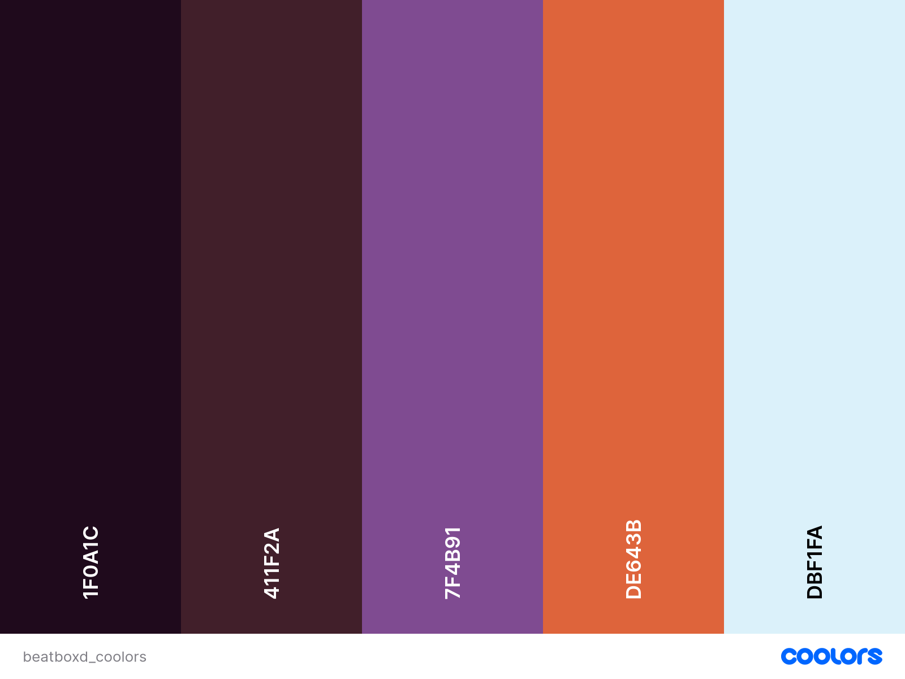
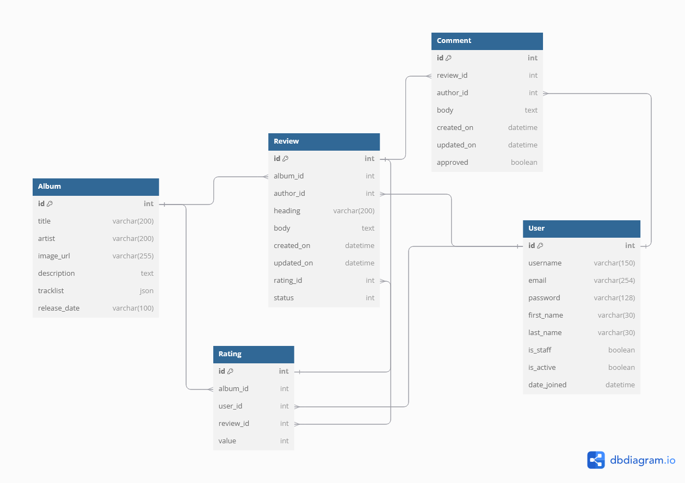

# BeatBoxd - Everyone's a critic!
If everyone's a critic-  why not share your opinion?

A fully responsive django web application that allows users to review and rate their favourite (or least favourite) albums. Users can comment on existing reviews to keep the discussion going. 


[Deployed Link](https://beatboxd-e433560dd363.herokuapp.com/)

## Contents:
- [UX - User Experience:](#ux---user-experience)
    - [User Stories](#user-stories)
    - [Wireframes](#wireframes)
    - [Design](#design)
    - [Accessibility](#accessibility)
    - [Fonts](#fonts)
- [Database Planning](#database)
- [Key Features:](#key-features)
    - [General](#general)
    - [Reviews](#reviews)
    - [Albums](#albums)
    - [Comments](#comments)
    - [Future Features]()
- [AI Implementation](#ai-implementation)
- [Testing:](#testing)
    - [Validators]()
        - [W3C]()
        - [Python]()
    - [Manual Testing]()
    - [Automated Testing]()
- [Deployment](#deployment)
    - [Heroku](#heroku)
    - [PostgreSQL - Code Institute](#postgresql---code-institute)
    - [LastFM API](#lastfm-api)
- [Credits](#credits)


## UX - User Experience

### User Stories:
Project Board: [link](https://github.com/users/aminoacid-01/projects/4)


[List User Stories If I have time later]

### Wireframes:
When I have time put wireframes for all relevant pages.

[Mobile wfs]
[Desktop wfs]
[Tablet wfs]

### Design:


#### Colour Scheme:

- #1f0a1c
- #dbf1fa
- #7f4b91
- #411f2a
- #de643b

Coolors was used to help workshop the overall colour scheme of BeatBoxed. After many iterations and testing the colours out in [Realtime Colors](https://www.realtimecolors.com/?colors=1f0a1c-dbf1fa-7f4b91-411f2a-de643b&fonts=Monoton-Truculenta), the current colour scheme is the one that was used for BeatBoxd.





### Accessibility:


### Fonts:
As pictured in the colour scheme section, Real Time Colours was also used to preview and plan potential font combinations. 

**Monoton**:
A retro style font

**Truculenta**:
A thin and stylish retro font for body text

## Database Planning
The album, review and rating models are unique custom models.
Models and their ERDs were planned out with the use of [dbdiagram.io](https://dbdiagram.io).




## Key Features

### General:
- **Navbar**: Displaying title in the Monoton font. Working navigational links to the homepage, sign in/out/up pages and create review page.
- **Footer**: Displays the copyright and project name.
- **Hero Banner**: Displays a photo of some cds to help the musical theming. A call to action with a button encouraging users to take part in the community and write their own reviews.
- **Error Pages**: Styled 404 and 500 pages. 404 page has a Silent Hill 2 reference. As the main cause of 500 errors in this project has been the Last.fm API, I referenced it in the error message.

### Reviews:
- **CRUD**: Both site admins and users with accounts can create, read, edit, and delete reviews. Users can only delete their reviews.
- **Create/Edit Review Form**: A front-facing form where logged-in individuals can create and edit reviews. Created reviews can be seen listed on the review list page. I used javascript to hide the album input information when selecting prexisting albums from the database and fill the hidden inputs with the information.
- **Delete**: Users can delete their own comments by clicking on the delete button. Upon clicking the button, they will be redirected to the delete confirmation page where they will be asked if they are sure they want to delete. The extra confirmation is to ensure users don't accidentally delete their own posts by misclicking.
- **Album Link**: The review database is linked to the album database, so users can select any prexisting albums from a dropdown or create a new album in the database while they are filling out the create review form.
- **Ratings**: When creating new reviews, users will have the option to rate the current album from 1-5. If a user has associated a rating with their review, it will display it above the review body text.
- **Read Reviews**: Users can look at a short list of recent reviews on the home page. There's also a dedicate review list page where users can see a list of all available reviews. The review list displays:
    - **Album Cover**
    - **Album Title and Artist**
    - **Review Title**
    - **Author**
    - **Created On**
    - **Review Excerpt**: Shows an excerpt of the full review. If the review body is longer than 250 characters, the excerpt will only be the first 247 characters followed by trailing ellipses.

- **Review Detailed View**: When a user clicks one of the reviews in the review list they are redirected to an expanded version of the review displaying:
    - **Album Cover**
    - **Album Title and Artist**
    - **Review Title**
    - **Author**
    - **Created On**
    - **Updated On**
    - **Rating** (only if a rating is associated with the review)
    - **Review Body**
    - **Comment Form**
    - **List of Comments**

 

### Albums:
- **LastFM API integration**: I used the LastFM api to fetch album information to fill the album database. I decided to use this rather than having users upload album information or filling it out myself because it's more efficient. It saves time for both the end-users and the site admins.
- **Average Rating**: Displayed alongside album information.


### Comments:
- **CRUD**: Both site admins and users with accounts can create, read, edit, and delete reviews. Users can only edit and delete their own comments.
- **Comments Form**: A form on the review detail page where logged-in users can post comments. Upon form submission, users are presented with feedback below the form letting them know that their comment has gone through and is awaiting approval.
- **Edit Comment Form**: Users can edit their own comments. JavaScript is used to make the edit button toggle the visibility of the edit form for better user experience.
- **Moderation**: Site admins can approve comments before they appear in the dedicated comment section.

## AI Implementation

Copilot was used for:
- Advice on planning out album model
- Speed up coding via auto complete.
- Assist with bootstrap grids when stuck.
- Some JS, such as:
    - auto populating the hidden fields with existing album data for the create reviews form.
    - hiding the edit comments form.
- Setting up the implementation of the LastFM API.
- Troubleshooting any errors that came from working with the LastFM API.
- Fixing template errors.
- Workshop how to step by step write some functions.
- Speed up writing and updating docstrings
- Some commit messages
- Quickly apply similar bootstrap styling of one template to other related templates to save time. (eg. styling other account templates to have the bootstrap classes of the sign_up page).
- Advise and feedback on changes to models to double check that migrating them wouldn't cause problems.
- Troubleshooting JSON errors caused by the API.

Some problems that were caused by using Copilot were:
- It was inconsistant with naming conventions, particularly in the js.
- It would remove my own comments that I wrote for my own future reference.
- Would sometimes write comments that were incorrect.
- It would remove endblocks and endifs, breaking some django templates.
- It sometimes would create unwanted changes and edits to other files in the workspace.

### Overall Experience W/ AI:

Despite the small inconveniences caused by the use of Copilot, I would say copilot has had a positive affect on this project. It has saved me a lot of time- particularly with troubleshooting. I don't think I would have been able to get as much done as I have in this timeframe without the use of Copilot. 
However, there were times where Copilot wasn't helpful and I had to read over the documentation for Django. 


## Testing

### Manual Testing:
[Something about]


### Unit Tests Results:

#### Views:

| Test Case                          | Description                                                                 | Status |
|------------------------------------|-----------------------------------------------------------------------------|--------|
| `test_review_detail_view`          | Tests the `review_detail` view to ensure it returns the correct status code, template, and contains the expected content. | Pass |
| `test_review_list_view`            | Tests the `review_list` view to ensure it returns the correct status code, template, and contains the expected content. | Pass |
| `test_user_review_list_view`       | Tests the `user_review_list` view to ensure it returns the correct status code, template, and contains the expected content for the logged-in user. | Pass |
| `test_recent_review_list_view`     | Tests the `recent_review_list` view to ensure it returns the correct status code, template, and contains the expected content. | Pass |
| `test_create_review_view`          | Tests the `create_review` view to ensure it returns the correct status code, template, and contains the expected forms. | Pass |
| `test_edit_review_view`            | Tests the `edit_review` view to ensure it returns the correct status code, template, and contains the expected form. | Pass |
| `test_delete_review_view`          | Tests the `delete_review` view to ensure it returns the correct status code and template. | Pass |
| `test_album_detail_view`           | Tests the `album_detail` view to ensure it returns the correct status code and JSON response with the expected album details. | Pass |

#### Forms:

#### Forms:

| Test Case                          | Description                                                                 | Status |
|------------------------------------|-----------------------------------------------------------------------------|--------|
| `TestCommentForm.test_form_is_valid`          | Tests the `CommentForm` to ensure it is valid when provided with a valid body. | Pass |
| `TestCommentForm.test_form_is_invalid`        | Tests the `CommentForm` to ensure it is invalid when the body is empty. | Pass |
| `TestReviewForm.test_form_is_valid`           | Tests the `ReviewForm` to ensure it is valid when provided with a valid heading and body. | Pass |
| `TestReviewForm.test_form_is_invalid`         | Tests the `ReviewForm` to ensure it is invalid when both the heading and body are empty. | Pass |
| `TestReviewForm.test_form_is_invalid_empty_heading` | Tests the `ReviewForm` to ensure it is invalid when the heading is empty but the body is provided. | Pass |
| `TestReviewForm.test_form_is_invalid_empty_body` | Tests the `ReviewForm` to ensure it is invalid when the body is empty but the heading is provided. | Pass |
| `TestAlbumForm.test_form_is_valid`            | Tests the `AlbumForm` to ensure it is valid when provided with a valid title, artist, image_url, and description. | Pass |
| `TestAlbumForm.test_form_is_invalid_empty_title` | Tests the `AlbumForm` to ensure it is invalid when the title is empty. | Pass |
| `TestAlbumForm.test_form_is_invalid_empty_artist` | Tests the `AlbumForm` to ensure it is invalid when the artist is empty. | Pass |
| `TestRatingForm.test_form_is_valid`           | Tests the `RatingForm` to ensure it is valid when provided with a value between 1 and 5. | Pass |
| `TestRatingForm.test_form_is_invalid_too_low` | Tests the `RatingForm` to ensure it is invalid when the value is below 1. | Pass |
| `TestRatingForm.test_form_is_invalid_too_high` | Tests the `RatingForm` to ensure it is invalid when the value is above 5. | Pass |


### Known Issues/Bugs:

- **Last.fm API**: Occasionally the review list pages and home page will time out or throw a server error due to the connection to http://ws.audioscrobbler.com/2.0/ timing out. 
- **Duplicate Albums in Database**: In some cases, when users double click the submit button it causes duplicate posts. It also causes two instances of the same Album in the database.
- **Duplicate Comments**: Upon reloading the review detail page after commenting, the comment is resubmitted. However, this comment only shows up on the admin panel as comments are moderated and wait for approval from the site admin.
- **Padding Issues on smaller screens on the review detail page**:


[Fill out with testing info]

## Deployment

### Heroku:
BeatBoxed was deployed via Heroku. Early deployment was utilised to ensure the project was properly configured and compatible with heroku.
1. Set up the Django project:
    - Ensure that Django is installed correctly and working locally.
    - Install gunicorn to prepare for deployment in Heroku.

2. Create a requirements.txt file with all of the dependancies
    - Run the command below to add your dependancies to the file.

    ```bash
    pip freeze > requirements.txt
    ```

3. Create a Procfile:
    - Make sure it's in the root of the project
    - Add the line below to the Procfile:
    ```bash
    web: gunicorn project_name.wsgi
    ```

4. Add Heroku to Allowed Hosts in settings.py:
    ```python
    ALLOWED_HOSTS = [
        'localhost', 
        '.herokuapp.com',
        ...
        ]
    ```

5. Set Debug to False in settings.py:
    - For security reasons, never have Debug = True when your project is deployed.

6. Add, commit and push all changes to Github

[finish later]
    

### PostgreSQL - Code Institute:
[steps] 

### LastFM API:
The project utilises the LastFM API to fetch album information to fill the Album database.

1. Sign up for Last.fm API key:
    - Go to https://www.last.fm/api/account/create
    - Create an API application and make a note of the API key.

2. Install reqests library:
    - Install the requests library using pip.
    - Use the requests library to make HTTP requests to the Last.fm API

3. Store API key in env.py
    - For security purposes, store the API key in the env.py.

4. Write a function to fetch and store album data from Last.fm using said API key.
    - the url: 'http://ws.audioscrobbler.com/2.0/'
    - Use the function to fetch and store data to the album model.

## Credits

- **Images:**
    - Album covers - Last.fm
    - Hero Image - Sergio Kian on [Unsplash](https://unsplash.com/photos/a-book-shelf-filled-with-lots-of-books-m7m2JJVB2No)

- **Code/Database Models**:
    - Used some of the steps I Think, Therefore I Blog tutorial to help set up the project.
    - Comment model - I Think, Therefore I Blog.
    - Used the highest rated answer from [this](https://stackoverflow.com/questions/17838607/making-an-iframe-responsive) stackoverflow post to make the iframe for summernote responsive.
    - Heavily referenced documentation for Django and django-summernote throughout development.


### Acknowlegements:


