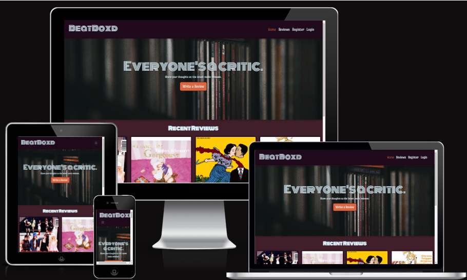
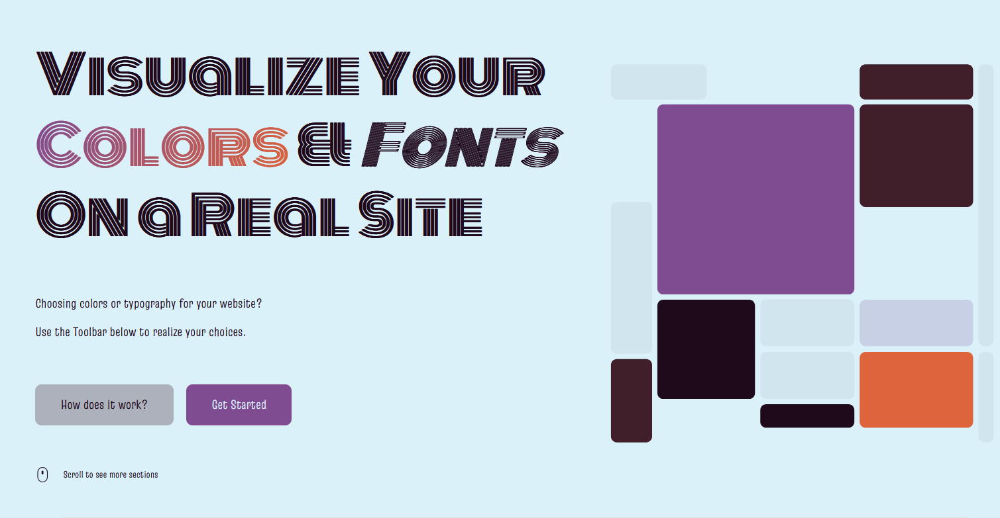

# BeatBoxd - Everyone's a critic!
If everyone's a critic-  why not share your opinion?

A fully responsive django web application that allows users to review and rate their favourite (or least favourite) albums. Users can comment on existing reviews to keep the discussion going. 




[Deployed Link](https://beatboxd-e433560dd363.herokuapp.com/)

## Contents:
- [UX - User Experience:](#ux---user-experience)
    - [User Stories](#user-stories)
    - [Wireframes](#wireframes)
    - [Design](#design)
    - [Accessibility](#accessibility)
    - [Fonts](#fonts)
- [Database Planning](#database)
- [Key Features:](#key-features)
    - [General](#general)
    - [Reviews](#reviews)
    - [Albums](#albums)
    - [Comments](#comments)
    - [Future Features](#future-features)
- [AI Implementation](#ai-implementation)
- [Testing:](#testing)
- [Deployment](#deployment)
    - [Heroku](#heroku)
    - [PostgreSQL - Code Institute](#postgresql---code-institute)
    - [LastFM API](#lastfm-api)
- [Credits](#credits)
- [Acknowledgements](#acknowlegements)


## UX - User Experience


### User Stories

| User Story                          | Description                                                                 | Priority |
|-------------------------------------|-----------------------------------------------------------------------------|----------|
| Account registration                | AS A site user I WANT to be able to register for an account SO THAT I can post reviews and comments. | Must Have |
| List Reviews                        | AS A site user I WANT to be able to look at a list of recently posted reviews SO THAT I can see other members of the community's opinions. | Must Have |
| Detailed review page                | AS A user I WANT to click on reviews on the review list SO THAT I can see the full review page. | Must Have |
| Paginated list of user's own reviews| AS A site user I WANT to be able to navigate to a list of my own reviews SO THAT if I want to edit or delete my reviews, I can easily find them all in one place. | Must Have |
| POST Reviews                        | AS A site user/admin I WANT to be able to post reviews SO THAT I can share my opinion and take part in a community. | Must Have |
| POST Comments                       | AS A site user I WANT to be able to post comments SO THAT I can take part in the community. | Must Have |
| Edit and Delete Comments            | AS A site user/admin I WANT to be able to edit and delete comments SO THAT I have full control over what I post. | Must Have |
| Fully Styled                        | AS A site admin I WANT a nicely styled web application SO THAT users and myself find it visually appealing. | Must Have |
| Log In/Out                          | AS A site user I WANT to be able to log in and out of my account SO THAT I can post reviews and comments. | Must Have |
| Moderate Comments                   | AS A site admin I WANT to review/approve comments SO THAT I can assure a positive and friendly community. | Must Have |
| Database of Albums                  | AS A site user I WANT to be able to select an album to review from a dropdown SO THAT I can easily review it without having to type out all of the details about it. | Should Have |
| Paginated List of User's Reviews    | AS A site user I WANT to be able to navigate to a list of my own reviews SO THAT if I want to edit or delete my reviews, I can easily find them all in one place. | Should Have |
| Related Review List                 | AS A user I WANT a list of related reviews displayed on the review detail page SO THAT I can quickly read other relevant reviews. | Should Have |
| Rating System                       | AS A site user I WANT to be able to rate the albums in my review out of 5 SO THAT I can express my opinion on the album I'm reviewing. | Should Have |
| Placeholder Images                  | AS A site admin/owner I WANT a placeholder image to appear in place of album covers when an album cover cannot be fetched SO THAT the review lists and review detail pages are visually cohesive, even when there isn't an available album cover. | Should Have |
| Paginated Review List               | AS A user I WANT to view a list of reviews with pagination SO THAT I don't get overloaded with information and have to scroll too much. | Could Have |
| User Profiles                       | AS A site user I WANT to have my own profile SO THAT I can be a part of a community. | Won't Have |
| Album Pages                         | AS A site user I WANT dedicated album pages that display a list of all current reviews SO THAT I can see multiple users' opinions on the album in one place. | Won't Have |
| Filter Reviews                      | AS A site user I WANT to be able to filter reviews by genre, artist, user, etc. SO THAT I can find specific reviews. | Won't Have |


### Wireframes:
When I have time put wireframes for all relevant pages.

#### Phones:


#### Tablets:


#### Desktop:


### Design:

|  |
|-----------|
| #1f0a1c   |
| #dbf1fa   |
| #7f4b91   |
| #411f2a   |
| #de643b   |


Coolors was used to help workshop the overall colour scheme of BeatBoxed. After many iterations and testing the colours out in [Realtime Colors](https://www.realtimecolors.com/?colors=1f0a1c-dbf1fa-7f4b91-411f2a-de643b&fonts=Monoton-Truculenta), the current colour scheme is the one that was used for BeatBoxd.

<details>
    <summary>Color Scheme Previews</summary>
    
    
</details>


### Accessibility:

Ensuring accessibility is a key aspect of the development process for BeatBoxd. The following measures have been taken to make the application accessible to all users:

#### Semantic HTML:
- Use of semantic HTML elements to provide meaningful structure to the content.
- Proper use of headings (`<h1>`, `<h2>`, etc.) to create a logical document outline.

#### Color Contrast:
- Ensuring sufficient color contrast between text and background to make content readable for users with visual impairments.
- Use of tools like [WebAIM Contrast Checker](https://webaim.org/resources/contrastchecker/) to verify color contrast ratios. 
- Only issue regarding colour contrast is with the btn-primary styling, it's just short of being a passable contrast.

#### Responsive Design:
- Ensuring that the application is fully responsive and accessible on various devices and screen sizes.
- Use of media queries and bootstrap grids to adapt to different screen resolutions.

#### Testing:
- Conducting accessibility testing using tools like [Lighthouse](https://developers.google.com/web/tools/lighthouse).
- All pages have a score of over 90 in accessibility when using Lighthouse.
- Regularly reviewing and updating accessibility features based on user feedback and testing results.

By implementing these accessibility practices, BeatBoxd aims to provide an inclusive experience for all users, regardless of their abilities or disabilities.


### Fonts:
As pictured in the colour scheme section, Real Time Colours was also used to preview and plan potential font combinations. 

**Monoton**:
A retro style font

**Truculenta**:
A thin and stylish retro font for body text

## Database Planning
The album, review and rating models are unique custom models.
Models and their ERDs were planned out with the use of [dbdiagram.io](https://dbdiagram.io).


## Agile

Throughout the development of this project, MoSCoW prioritisation was used alongside a Kanban board to help keep track of progress and breakdown tasks. A more detailed example of my utilisation of MoSCoW prioritisation can be seen above in the [User Stories](#user-stories) section.

Project Board: [link](https://github.com/users/aminoacid-01/projects/4)

## Key Features

### General:
- **Navbar**: Displaying title in the Monoton font. Working navigational links to the homepage, sign in/out/up pages and create review page.


- **Footer**: Displays the copyright and project name.
- **Hero Banner**: Displays a photo of some cds to help the musical theming. A call to action with a button encouraging users to take part in the community and write their own reviews.


- **Error Pages**: Styled 404 and 500 pages. 404 page has a Silent Hill 2 reference. As the main cause of 500 errors in this project has been the Last.fm API, I referenced it in the error message.


### Reviews:
- **CRUD**: Both site admins and users with accounts can create, read, edit, and delete reviews. Users can only delete their reviews.
- **Create/Edit Review Form**: A front-facing form where logged-in individuals can create and edit reviews. Created reviews can be seen listed on the review list page. I used javascript to hide the album input information when selecting prexisting albums from the database and fill the hidden inputs with the information.
- **Delete**: Users can delete their own comments by clicking on the delete button. Upon clicking the button, they will be redirected to the delete confirmation page where they will be asked if they are sure they want to delete. The extra confirmation is to ensure users don't accidentally delete their own posts by misclicking.
- **Album Link**: The review database is linked to the album database, so users can select any prexisting albums from a dropdown or create a new album in the database while they are filling out the create review form.
- **Ratings**: When creating new reviews, users will be prompted to rate the current album from 1-5. The rating is displayed above the review body.
- **Read Reviews**: Users can look at a short list of recent reviews on the home page. There's also a dedicate review list page where users can see a list of all available reviews. The review list displays:
    - **Album Cover**
    - **Album Title and Artist**
    - **Review Title**
    - **Author**
    - **Created On**
    - **Review Excerpt**: Shows an excerpt of the full review. If the review body is longer than 250 characters, the excerpt will only be the first 247 characters followed by trailing ellipses.

- **Review Detailed View**: When a user clicks one of the reviews in the review list they are redirected to an expanded version of the review displaying:
    - **Album Cover**
    - **Album Title and Artist**
    - **Review Title**
    - **Author**
    - **Created On**
    - **Updated On**
    - **Rating** 
    - **Review Body**
    - **Comment Form**
    - **List of Comments**

 

### Albums:
- **LastFM API integration**: I used the LastFM api to fetch album information to fill the album database. I decided to use this rather than having users upload album information or filling it out myself because it's more efficient. It saves time for both the end-users and the site admins.


### Comments:
- **CRUD**: Both site admins and users with accounts can create, read, edit, and delete reviews. Users can only edit and delete their own comments.
- **Comments Form**: A form on the review detail page where logged-in users can post comments. Upon form submission, users are presented with feedback below the form letting them know that their comment has gone through and is awaiting approval.
- **Edit Comment Form**: Users can edit their own comments. JavaScript is used to make the edit button toggle the visibility of the edit form for better user experience.
- **Moderation**: Site admins can approve comments before they appear in the dedicated comment section.

### Future Features:

- **User Profiles**: Allow users to have their own profiles to foster a sense of community.
- **Album Pages**: Create dedicated album pages that display a list of all current reviews for each album.
- **Filter Reviews**: Implement functionality to filter reviews by genre, artist, user, etc., to help users find specific reviews.
- **Draft Reviews**: Allow users to save their reviews as a draft to finish later.

## AI Implementation

Copilot was used for:
- Advice on planning out album model
- Speed up coding via auto complete.
- Assist with bootstrap grids when stuck.
- Help with some JS, such as:
    - auto populating the hidden fields with existing album data for the create reviews form.
    - hiding the edit comments form.
- Setting up the implementation of the LastFM API.
- Troubleshooting any errors that came from working with the LastFM API.
- Fixing template errors.
- Workshop how to go about writing some views and functions step by step.
- Speed up writing and updating docstrings
- Some commit messages
- Quickly apply similar bootstrap styling of one template to other related templates to save time. (eg. styling other account templates to have the bootstrap classes of the sign_up page).
- Advise and feedback on changes to models to double check that migrating them wouldn't cause problems.
- Troubleshooting JSON errors caused by the API.

Some problems that were caused by using Copilot were:
- It was inconsistant with naming conventions, particularly in the js.
- It would remove my own comments that I wrote for my own future reference.
- Would sometimes write comments that were incorrect.
- It would remove endblocks and endifs, breaking some django templates.
- It sometimes would create unwanted changes and edits to other files in the workspace.

### Overall Experience:

Despite the small inconveniences caused by the use of Copilot, I would say copilot has had a positive affect on this project. It has saved me a lot of time- particularly with troubleshooting. I don't think I would have been able to get as much done as I have in this timeframe without the use of Copilot. 
However, there were times where Copilot wasn't helpful and I had to read over the documentation for Django. 


## Testing

See [testing.md](testing.md) for details regarding manual testing, unit testing, validators and lighthouse results.


## Deployment

### Heroku:
BeatBoxed was deployed via Heroku. Early deployment was utilised to ensure the project was properly configured and compatible with heroku.
1. Set up the Django project:
    - Ensure that Django is installed correctly and working locally.
    - Install gunicorn to prepare for deployment in Heroku.

2. Create a requirements.txt file with all of the dependancies
    - Run the command below to add your dependancies to the file.

    ```bash
    pip freeze > requirements.txt
    ```

3. Create a Procfile:
    - Make sure it's in the root of the project
    - Add the line below to the Procfile:
    ```bash
    web: gunicorn project_name.wsgi
    ```

4. Add Heroku to Allowed Hosts in settings.py:
    ```python
    ALLOWED_HOSTS = [
        'localhost', 
        '.herokuapp.com',
        ...
        ]
    ```

5. Set Debug to False in settings.py:
    - For security reasons, never have ```Debug = True``` when your project is deployed.

6. Add, commit and push all changes to Github

7. Log in to Heroku

8. Create a new Heroku app

9. Configure environment variables:
    - Set up necessary environment variables in Heroku, including the database URL and any API keys.
    ```
    DISABLE_COLLECTSTATIC=1
    DATABASE_URL=your-database-url
    LASTFM_API_KEY=your-api-key
    ```

10. Connect your Github Repo to Heroku

11. Deploy from the main branch
    

### PostgreSQL - Code Institute:

The PostgreSQL database provided by Code Institute is used to store information for this project.


### LastFM API:
The project utilises the LastFM API to fetch album information to fill the Album database.

**Setting up the API for usage:**
1. Sign up for Last.fm API key:
    - Go to https://www.last.fm/api/account/create
    - Create an API application and make a note of the API key.

2. Install reqests library:
    - Install the requests library using pip.
    - Use the requests library to make HTTP requests to the Last.fm API

3. Store API key in env.py
    - For security purposes, store the API key in the env.py.


## Technologies Used:

- **Heroku**: Platform as a service (PaaS) for deploying web applications.
- **Gunicorn**: Python WSGI HTTP Server for UNIX.
- **Copilot**: AI pair programmer to assist with code completion and suggestions.
- **Coolors**: Color scheme generator for creating color palettes.
- **RealTimeColors**: Tool for previewing and planning color schemes and font combinations.
- **Balsamiq**: Wireframing tool for creating mockups and wireframes.
- **Git**: Version control system for tracking changes in source code.
- **GitHub**: Hosting service for Git repositories.
- **HTML**: Standard markup language for creating web pages.
- **CSS**: Style sheet language for describing the presentation of web pages.
- **JavaScript**: Programming language for creating interactive web pages.
- **Python**: High-level programming language for general-purpose programming.
- **Django**: High-level Python web framework for rapid development.
- **Summernote**: WYSIWYG editor for web applications.
- **Whitenoise**: Middleware for serving static files in Django.
- **AllAuth**: Integrated set of Django applications addressing authentication, registration, account management.
- **PostgreSQL**: Open-source relational database management system.
- **Bootstrap**: Front-end framework for developing responsive and mobile-first websites.
- **LastFM API**: Service for fetching album information.


## Credits

- **Images:**
    - Album covers - Last.fm
    - Placeholder Cover - Nechama Lock on [Unsplash](https://unsplash.com/photos/purple-and-pink-abstract-painting-dLFmwIOGNYo)
    - Hero Image - Sergio Kian on [Unsplash](https://unsplash.com/photos/a-book-shelf-filled-with-lots-of-books-m7m2JJVB2No)

- **Code/Database Models**:
    - Used some of the steps I Think, Therefore I Blog tutorial to help set up the project.
    - Comment model - I Think, Therefore I Blog.
    - Used the highest rated answer from [this stackoverflow post](https://stackoverflow.com/questions/17838607/making-an-iframe-responsive) to make the iframe for summernote responsive.
    - Heavily referenced documentation for Django and django-summernote throughout development.


### Acknowlegements:

Thanks to:
- Emma Lamont, for being a great motivator, offering useful advise and listening to me complain about my constant internet problems throughout the course!
- My older sister, for lending me her services as a QA tester and giving me feedback on my project.