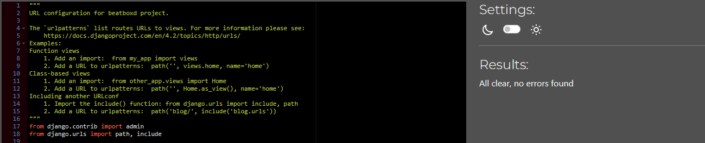
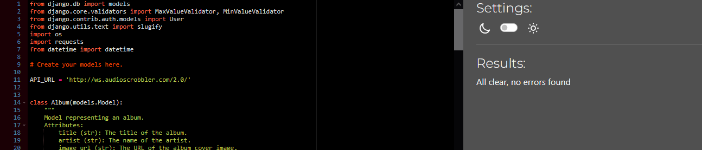
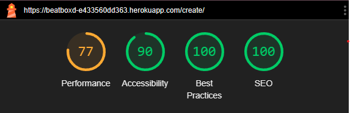
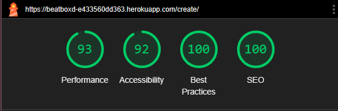
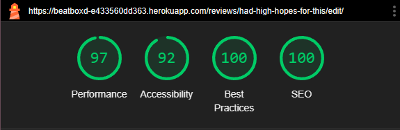

# Testing

## Manual Testing:

| Feature                            | Description                                                                 | Status |
|------------------------------------|-----------------------------------------------------------------------------|--------|
| Navigational links in Navbar       | Ensure all navigational links in the navbar are working correctly.          | Pass   |
| Links on all pages                 | Verify that all links on various pages are functional and redirect correctly. | Pass   |
| Form input on create_review page   | Test the form input fields on the create review page to ensure they accept and process data correctly. | Pass   |
| Responsiveness on all screen sizes | Check the responsiveness of the site on different screen sizes to ensure proper display and functionality. | Pass   |

## Unit Testing:

### Views:

| Test Case                          | Description                                                                 | Status |
|------------------------------------|-----------------------------------------------------------------------------|--------|
| `test_review_detail_view`          | Tests the `review_detail` view to ensure it returns the correct status code, template, and contains the expected content. | Pass |
| `test_review_list_view`            | Tests the `review_list` view to ensure it returns the correct status code, template, and contains the expected content. | Pass |
| `test_user_review_list_view`       | Tests the `user_review_list` view to ensure it returns the correct status code, template, and contains the expected content for the logged-in user. | Pass |
| `test_recent_review_list_view`     | Tests the `recent_review_list` view to ensure it returns the correct status code, template, and contains the expected content. | Pass |
| `test_create_review_view`          | Tests the `create_review` view to ensure it returns the correct status code, template, and contains the expected forms. | Pass |
| `test_edit_review_view`            | Tests the `edit_review` view to ensure it returns the correct status code, template, and contains the expected form. | Pass |
| `test_delete_review_view`          | Tests the `delete_review` view to ensure it returns the correct status code and template. | Pass |
| `test_album_detail_view`           | Tests the `album_detail` view to ensure it returns the correct status code and JSON response with the expected album details. | Pass |

### Forms:

| Test Case                          | Description                                                                 | Status |
|------------------------------------|-----------------------------------------------------------------------------|--------|
| `TestCommentForm.test_form_is_valid`          | Tests the `CommentForm` to ensure it is valid when provided with a valid body. | Pass |
| `TestCommentForm.test_form_is_invalid`        | Tests the `CommentForm` to ensure it is invalid when the body is empty. | Pass |
| `TestReviewForm.test_form_is_valid`           | Tests the `ReviewForm` to ensure it is valid when provided with a valid heading and body. | Pass |
| `TestReviewForm.test_form_is_invalid`         | Tests the `ReviewForm` to ensure it is invalid when both the heading and body are empty. | Pass |
| `TestReviewForm.test_form_is_invalid_empty_heading` | Tests the `ReviewForm` to ensure it is invalid when the heading is empty but the body is provided. | Pass |
| `TestReviewForm.test_form_is_invalid_empty_body` | Tests the `ReviewForm` to ensure it is invalid when the body is empty but the heading is provided. | Pass |
| `TestAlbumForm.test_form_is_valid`            | Tests the `AlbumForm` to ensure it is valid when provided with a valid title, artist, image_url, and description. | Pass |
| `TestAlbumForm.test_form_is_invalid_empty_title` | Tests the `AlbumForm` to ensure it is invalid when the title is empty. | Pass |
| `TestAlbumForm.test_form_is_invalid_empty_artist` | Tests the `AlbumForm` to ensure it is invalid when the artist is empty. | Pass |
| `TestRatingForm.test_form_is_valid`           | Tests the `RatingForm` to ensure it is valid when provided with a value between 1 and 5. | Pass |
| `TestRatingForm.test_form_is_invalid_too_low` | Tests the `RatingForm` to ensure it is invalid when the value is below 1. | Pass |
| `TestRatingForm.test_form_is_invalid_too_high` | Tests the `RatingForm` to ensure it is invalid when the value is above 5. | Pass |

## Validators:
### W3C:
All errors flagged by W3C's markdown validator are caused by django-summernote, not of the HTML. I spent a lot of time trying to work around these errors but they won't go away unless I remove summernote and delete all reviews written with it.

- **HTML**:
    - Index

    
    - Review List

    
    - User Review List

    
    - Review Detail

    
    - Create Review

    
    .png)
    - Edit Review

    
    .png)

    - Delete Review

    

    

### Jigsaw:
Used Jisaw CSS validator with no errors.
- **CSS**
    - style.css

     

### JsHint:

While I understand it's better practice to try to have one js script file, as these are specific to only one page and only have one use each, I just made them two seperate files.
Jshint used, no errors flagged.
- **JS**
    - create_review.js

    
    - edit_review.js

    

### Code Institute's Python Linter:
Used Code Institute's Python Linter to ensure my code is up to PEP8 standards. In settings.py, one line is too long. However I cannot shorten it as it's one of the auth password validators. Other than that, all python code passes validation.

- **Python**
    - settings.py

    
    - urls.py

    
    - review/views.py 

    
    - review/urls.py

    

    - review/models.py

    
    - review/admin.py

    

    - review/forms.py

    

    - review/test_forms.py

    
    - review/test_views.py

    

## Lighthouse:

On certain pages, the performance (particularly on pages containing a summernote widget) on mobile is less than ideal. The Lastfm API also has a slight negative affect on perfomance.

- **Index**
    - mobile

    

    - desktop 

    

- **Review List**
    - mobile

    

    - desktop

    

- **User Review List**
    - mobile

    

    - desktop

    

- **Review Detail**
    - mobile 

    

    - desktop

    

- **Create Review**
    - mobile

    

    - desktop

    

    
- **Edit Review**
    - mobile

    

    - desktop

    

- **Delete Review**
    - mobile

    

    - desktop

    

## Known Issues/Bugs:

- **Last.fm API**: Occasionally the review list pages and home page will time out or throw a server error due to the connection to http://ws.audioscrobbler.com/2.0/ timing out. 
- **Duplicate Albums in Database**: In some cases, when users double click the submit button it causes duplicate posts. It also causes two instances of the same Album in the database.
- **Duplicate Comments**: Upon reloading the review detail page after commenting, the comment is resubmitted. However, this comment only shows up on the admin panel as comments are moderated and wait for approval from the site admin.
- **Padding Issues on smaller screens on the review detail page**: The card displaying the album information appears too large on smaller screens. All content is visible and it doesn't affect user experience, but it's not ideal.
